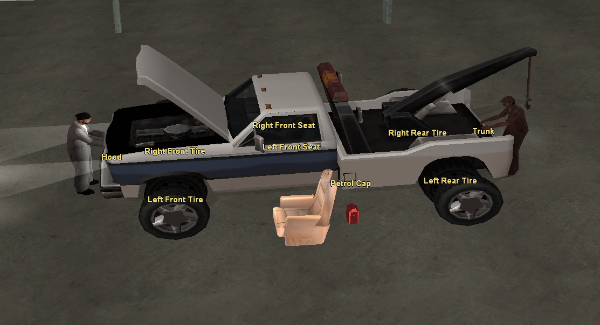
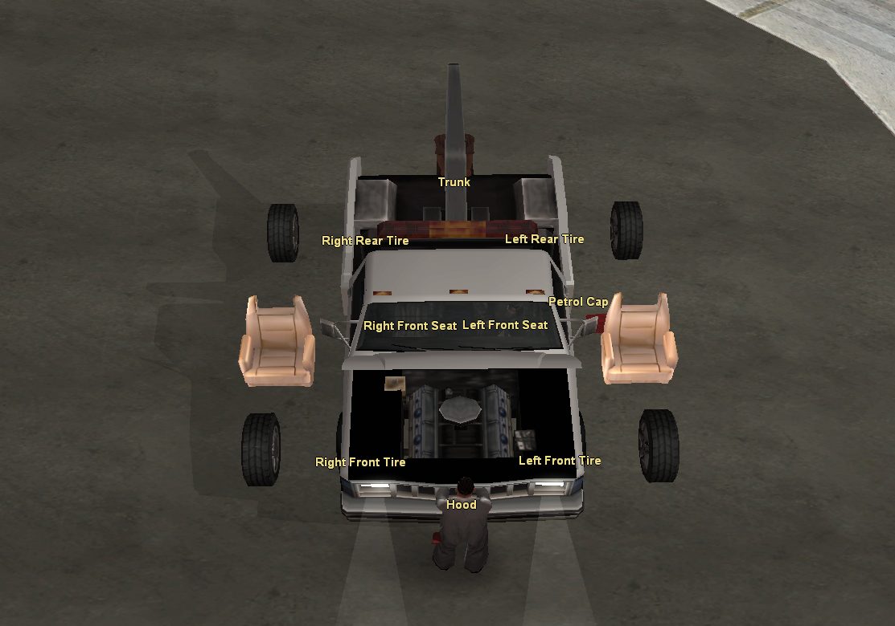

# VehiclePartPosition - SAMP

## GetPosNearVehiclePart ##
Use this function to obtain the position in the world of a certain part of the vehicle, being able to define a distance between the part of the vehicle and the position in the world. You can use it to create a 3D text, checkpoint, pickup or object in that position.

## GetVehiclePartPos ##
Use this function to obtain the position of a specific part of the vehicle. You can use it to attach 3D text or an object.

## IsPlayerNearVehiclePart ##
Use this function to detect if a player is near a vehicle part.

## SetPlayerNearVehiclePart ##
Use this function to teleport a player to the front a vehicle part.

## GetVehiclePartName ##
Use this function to get the vehicle part names.

Examples:

	new vehid=1,string[30]; //Change the vehid
	SetPlayerNearVehiclePart(playerid, vehid, VEH_PART_PCAP);
	format(string, sizeof(string),"~w~%s", GetVehiclePartName(VEH_PART_PCAP));
	GameTextForPlayer(playerid, string, 5000, 4);
	SetCameraBehindPlayer(playerid);
	
	new Float:pos[3],Float:a,mechanic,Text3D:vtext;
	new engine, lights, alarm, doors, bonnet, boot, objective;
	GetVehicleParamsEx(GetPlayerVehicleID(playerid), engine, lights, alarm, doors, bonnet, boot, objective);
	SetVehicleParamsEx(GetPlayerVehicleID(playerid), engine, lights, alarm, doors, 1, 1, objective);
	GetVehicleZAngle(GetPlayerVehicleID(playerid), a);

	//Front Tire - Bikes
	GetVehiclePartPos(GetPlayerVehicleID(playerid), VEH_PART_FTIRE, pos[0], pos[1], pos[2]);
	vtext = Create3DTextLabel("Front Tire", 0xEEDD82FF, pos[0], pos[1], pos[2], 5.0, 0);
	Attach3DTextLabelToVehicle(vtext, GetPlayerVehicleID(playerid), pos[0], pos[1], pos[2]);
	GetPosNearVehiclePart(GetPlayerVehicleID(playerid), VEH_PART_FTIRE, pos[0], pos[1], pos[2],1.0);
	CreateDynamicObject(1098, pos[0], pos[1], pos[2], 0.0, 0.0, 0.0);

	//Rear Tire - Bikes
	GetVehiclePartPos(GetPlayerVehicleID(playerid), VEH_PART_RTIRE, pos[0], pos[1], pos[2]);
	vtext = Create3DTextLabel("Rear Tire", 0xEEDD82FF, pos[0], pos[1], pos[2], 5.0, 0);
	Attach3DTextLabelToVehicle(vtext, GetPlayerVehicleID(playerid), pos[0], pos[1], pos[2]);
	GetPosNearVehiclePart(GetPlayerVehicleID(playerid), VEH_PART_RTIRE, pos[0], pos[1], pos[2],1.0);
	CreateDynamicObject(1098, pos[0], pos[1], pos[2], 0.0, 0.0, 0.0);

  	//Right Front Tire - Cars
	GetVehiclePartPos(GetPlayerVehicleID(playerid), VEH_PART_RFTIRE, pos[0], pos[1], pos[2]);
	vtext = Create3DTextLabel("Right Front Tire", 0xEEDD82FF, pos[0], pos[1], pos[2], 5.0, 0);
  	Attach3DTextLabelToVehicle(vtext, GetPlayerVehicleID(playerid), pos[0], pos[1], pos[2]);
  	GetPosNearVehiclePart(GetPlayerVehicleID(playerid), VEH_PART_RFTIRE, pos[0], pos[1], pos[2],1.0);
  	CreateDynamicObject(1098, pos[0], pos[1], pos[2]-0.25, 0.0, 0.0, a);

	//Left Front Tire - Cars
  	GetVehiclePartPos(GetPlayerVehicleID(playerid), VEH_PART_LFTIRE, pos[0], pos[1], pos[2]);
  	vtext = Create3DTextLabel("Left Front Tire", 0xEEDD82FF, pos[0], pos[1], pos[2], 5.0, 0);
  	Attach3DTextLabelToVehicle(vtext, GetPlayerVehicleID(playerid), pos[0], pos[1], pos[2]);
  	GetPosNearVehiclePart(GetPlayerVehicleID(playerid), VEH_PART_LFTIRE, pos[0], pos[1], pos[2],1.0);
  	CreateDynamicObject(1098, pos[0], pos[1], pos[2]-0.25, 0.0, 0.0, a);

	//Right Rear Tire - Cars
  	GetVehiclePartPos(GetPlayerVehicleID(playerid),VEH_PART_RRTIRE, pos[0], pos[1], pos[2]);
  	vtext = Create3DTextLabel("Right Rear Tire", 0xEEDD82FF, pos[0], pos[1], pos[2], 5.0, 0);
  	Attach3DTextLabelToVehicle(vtext, GetPlayerVehicleID(playerid), pos[0], pos[1], pos[2]);
  	GetPosNearVehiclePart(GetPlayerVehicleID(playerid), VEH_PART_RRTIRE, pos[0], pos[1], pos[2],1.0);
  	CreateDynamicObject(1098, pos[0], pos[1], pos[2]-0.25, 0.0, 0.0, a);

	//Left Rear Tire - Cars
  	GetVehiclePartPos(GetPlayerVehicleID(playerid), VEH_PART_LRTIRE, pos[0], pos[1], pos[2]);
  	vtext = Create3DTextLabel("Left Rear Tire", 0xEEDD82FF, pos[0], pos[1], pos[2], 5.0, 0);
  	Attach3DTextLabelToVehicle(vtext, GetPlayerVehicleID(playerid), pos[0], pos[1], pos[2]);
  	GetPosNearVehiclePart(GetPlayerVehicleID(playerid), VEH_PART_LRTIRE, pos[0], pos[1], pos[2],1.0);
  	CreateDynamicObject(1098, pos[0], pos[1], pos[2]-0.25, 0.0, 0.0, a);
	
	//Right Front Seat - Cars
	GetVehiclePartPos(GetPlayerVehicleID(playerid), VEH_PART_RFSEAT, pos[0], pos[1], pos[2]);
	vtext = Create3DTextLabel("Right Front Seat", 0xEEDD82FF, pos[0], pos[1], pos[2], 5.0, 0);
 	Attach3DTextLabelToVehicle(vtext, GetPlayerVehicleID(playerid), pos[0], pos[1], pos[2]);
 	GetPosNearVehiclePart(GetPlayerVehicleID(playerid), VEH_PART_RFSEAT, pos[0], pos[1], pos[2],1.5);
	CreateDynamicObject(1562, pos[0], pos[1], pos[2]-0.25, 0.0, 0.0, a-180.0);
	
	//Left Front Seat - Cars
	GetVehiclePartPos(GetPlayerVehicleID(playerid), VEH_PART_LFSEAT, pos[0], pos[1], pos[2]);
	vtext = Create3DTextLabel("Left Front Seat", 0xEEDD82FF, pos[0], pos[1], pos[2], 5.0, 0);
 	Attach3DTextLabelToVehicle(vtext, GetPlayerVehicleID(playerid), pos[0], pos[1], pos[2]);
 	GetPosNearVehiclePart(GetPlayerVehicleID(playerid), VEH_PART_LFSEAT, pos[0], pos[1], pos[2],1.5);
	CreateDynamicObject(1562, pos[0], pos[1], pos[2]-0.25, 0.0, 0.0, a-180.0);

  	//Hood
  	GetVehiclePartPos(GetPlayerVehicleID(playerid), VEH_PART_HOOD, pos[0], pos[1], pos[2]);
  	vtext = Create3DTextLabel("Hood", 0xEEDD82FF, pos[0], pos[1], pos[2], 5.0, 0);
  	Attach3DTextLabelToVehicle(vtext, GetPlayerVehicleID(playerid), pos[0], pos[1], pos[2]);
  	GetPosNearVehiclePart(GetPlayerVehicleID(playerid), VEH_PART_HOOD, pos[0], pos[1], pos[2],0.3);
  	mechanic = CreateActor(50, pos[0], pos[1], pos[2], a-180.0);
  	SetActorVirtualWorld(mechanic, 0);
  	ApplyActorAnimation(mechanic, "PED","DRIVE_BOAT",4.0,1,0,0,1,1);

  	//Trunk
  	GetVehiclePartPos(GetPlayerVehicleID(playerid), VEH_PART_TRUNK, pos[0], pos[1], pos[2]);
  	vtext = Create3DTextLabel("Trunk", 0xEEDD82FF, pos[0], pos[1], pos[2], 5.0, 0);
  	Attach3DTextLabelToVehicle(vtext, GetPlayerVehicleID(playerid), pos[0], pos[1], pos[2]);
  	GetPosNearVehiclePart(GetPlayerVehicleID(playerid), VEH_PART_TRUNK, pos[0], pos[1], pos[2],0.25);
  	mechanic = CreateActor(8, pos[0], pos[1], pos[2], a);
  	SetActorVirtualWorld(mechanic, 0);
  	ApplyActorAnimation(mechanic, "PED","DRIVE_BOAT",4.0,1,0,0,1,1);

  	//Petrol Cap
  	GetVehiclePartPos(GetPlayerVehicleID(playerid), VEH_PART_PCAP, pos[0], pos[1], pos[2]);
  	vtext = Create3DTextLabel("Petrol Cap", 0xEEDD82FF, pos[0], pos[1], pos[2], 5.0, 0);
  	Attach3DTextLabelToVehicle(vtext, GetPlayerVehicleID(playerid), pos[0], pos[1], pos[2]);
  	GetPosNearVehiclePart(GetPlayerVehicleID(playerid), VEH_PART_PCAP, pos[0], pos[1], pos[2],0.25);
  	CreateDynamicObject(1650, pos[0], pos[1], pos[2]-0.5, 0.0, 0.0, a);

